# App gallery

Screenshots generated by `tool/take_app_screenshots.sh` — re-run that script
(after any layout change) rather than editing these files by hand.

## Screens

### Monitor
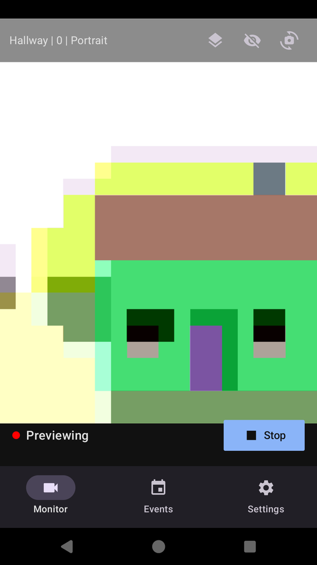

Live camera preview with detector status and the monitoring start control.

### Events
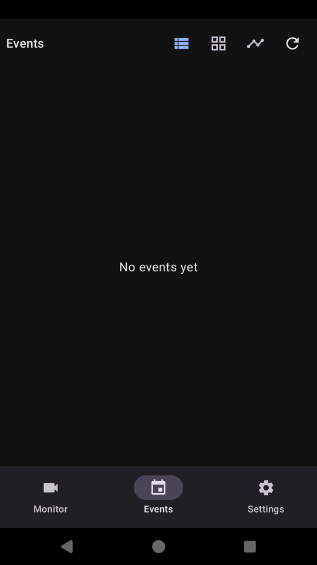

Recorded events with snapshot thumbnails, list/grid toggle and manual reload.

### Settings
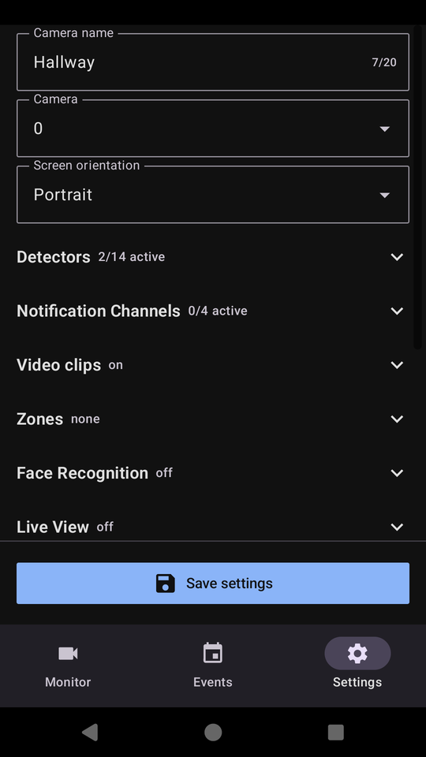

Camera selection and the collapsible configuration sections captured below.

## Settings sections

Each section is shown expanded, cropped to its own region.

### Detectors
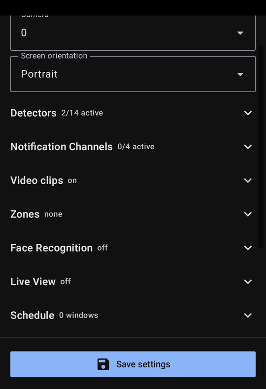

Detector groups (camera/audio/combined/system) with per-detector mode and thresholds.

### Regions
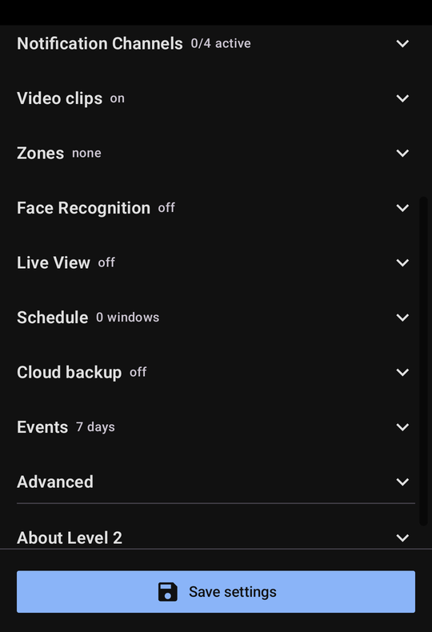

Inclusion/exclusion detection regions and the editor entry point.

### Face Recognition
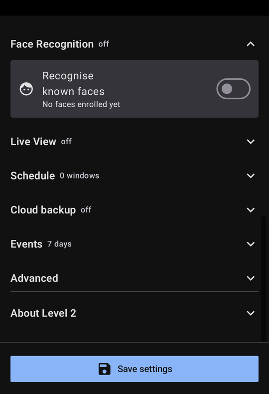

Known-face enrolment and recognition toggle.

### Channels
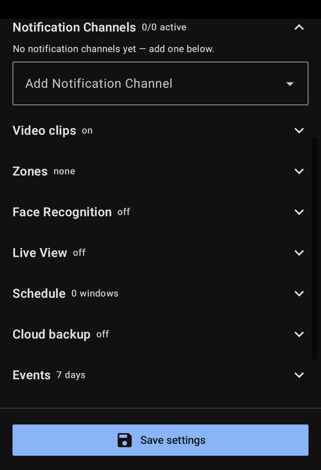

Notification channels (Pushover, webhook, e-mail, log) with test-send controls.

### Schedule
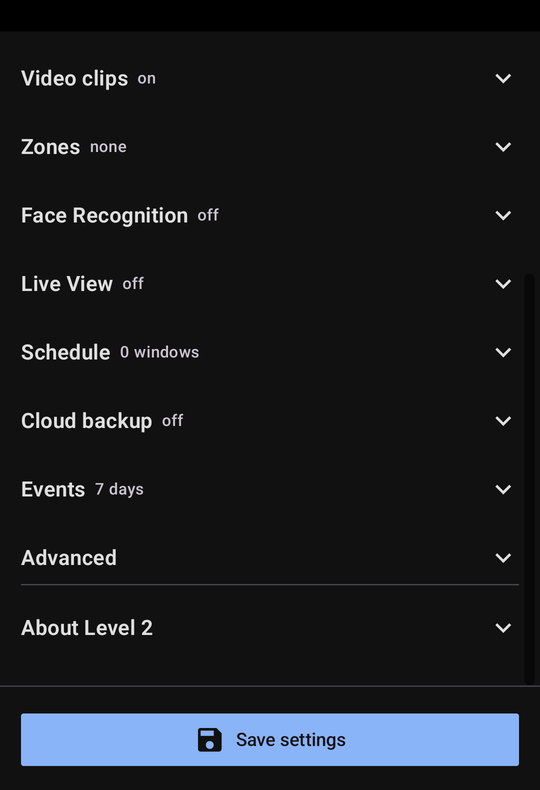

Monitoring schedule windows with pre-/post-roll.

### Video clips
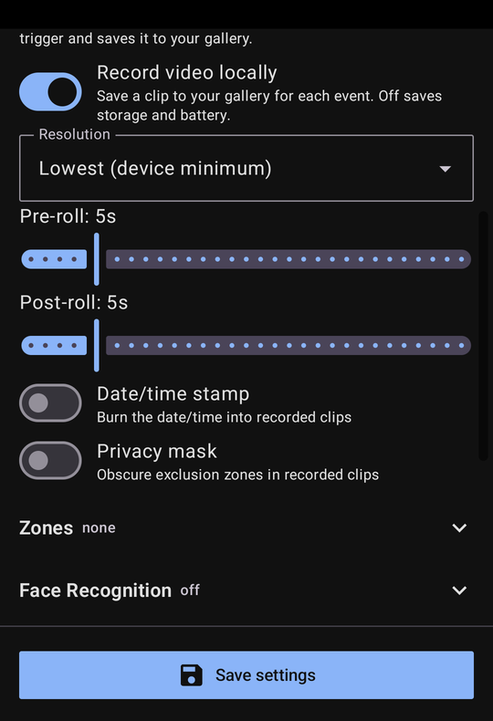

Local clip recording, date/time stamping and privacy masking.

### Live View
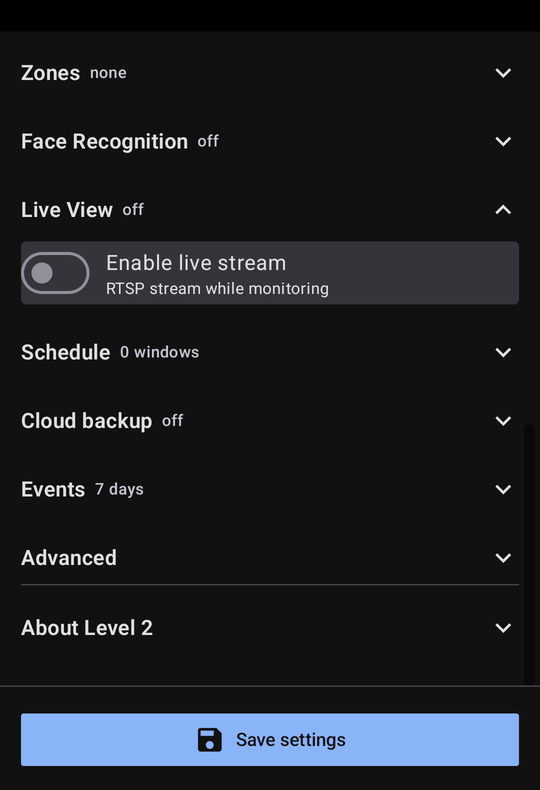

RTSP live stream, authentication and audio options.

### Cloud backup
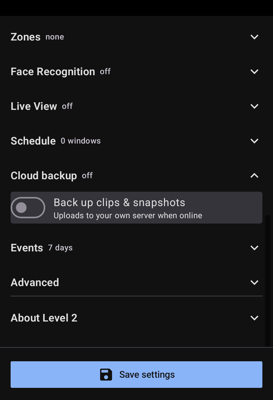

Self-hosted backup of clips and snapshots.

### Events
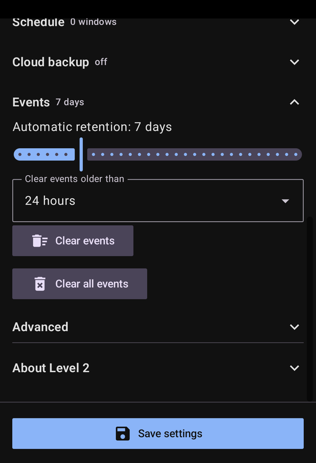

Event retention and clearing.

### Advanced
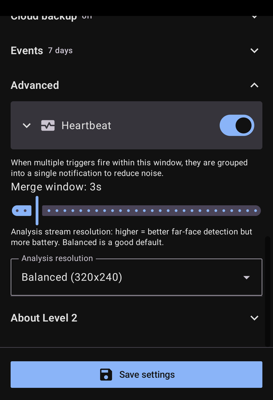

Advanced diagnostics and maintenance actions.

